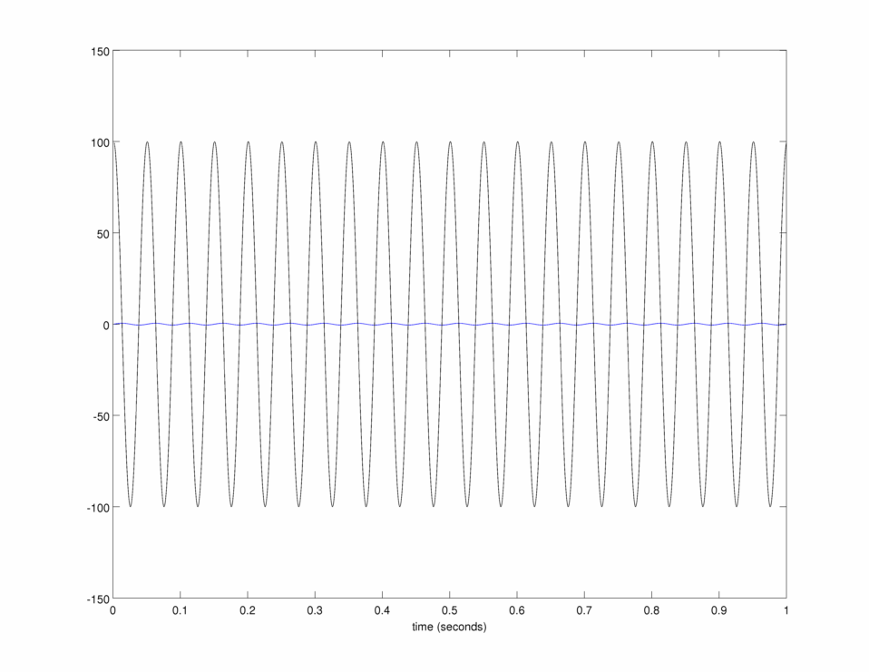

Decimation:
----------
This library implements a polyphase FIR decimation filter. The decimation class is used to decimate the input signal by a factor of two.

Low-pass filter:
---------------
This matlab command is used to generate the FIR filter:

b = fir1(47,0.43);

the impulse response of the filter in time and frequency domains:

Tests:
------

Simulated signal with two components:
1- cosine at 1700 Hz
2- cosine at 20 Hz

and sampling rate at 25000 Hz:

Needed libraries:
------
1. Boost::Circular_buffer

Compile:
-------
cmake based

