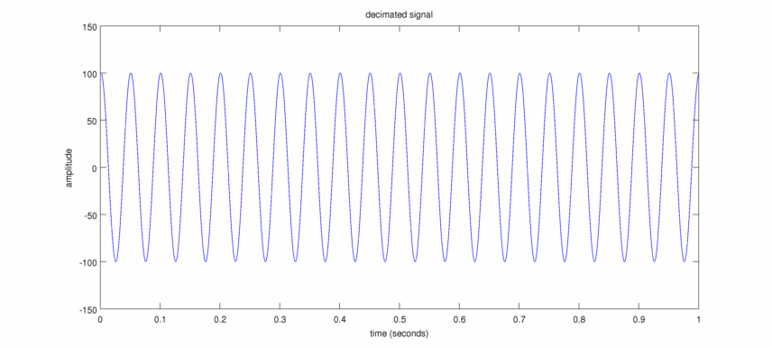

Decimation:
----------
This library implements a polyphase FIR decimation filter [wikipedia](http://en.wikipedia.org/wiki/Multi-rate_digital_signal_processing#Polyphase_Decomposition). The decimation class is used to decimate the input signal by a factor of two.

Low-pass filter:
---------------
This matlab command is used to generate the FIR filter:

b = fir1(47,0.43);

the impulse response of the filter in time and frequency domains:

Tests:
------

Simulated signal with two components:
1- cosine at 1700 Hz
2- cosine at 20 Hz

and sampling rate at 25000 Hz:

In four test cases the output of the code is compared with Matlab's decimate function:

1. 20 Hz cosine with amplitude of 100 + 12000 Hz cosine with amplitude of 10

2. 20 Hz cosine with amplitude of 100 + 6250 Hz cosine with amplitude of 10

3. 20 Hz cosine with amplitude of 100 + 3000 Hz cosine with amplitude of 10

4. 20 Hz cosine with amplitude of 100 + 1000 Hz cosine with amplitude of 10

Matlab code to plot the above figures:
--------------------------------------
    >> signal = csvread('signal4.csv');
    >> decsignal = csvread('decimated_signal4.csv');
    >> d = moddecimate(signal(2:end,2),2,47,'fir');
    >> plot(t, decsignal(:,2), '-.', t, d(12:end-12), ':r', t, decsignal(:,2)-d(12:end-12),'k', 'linewidth', 2);
    >> legend('avxDecimate', 'matlab', 'avxDecimate-matlab');
    >> xlabel('time (seconds)');
    >> ylabel('amplitude');
    >> title('20 Hz cosine + 1000 Hz cosine')

moddecimate is a copy of the decimate function with only one change:

original:

    line 93: b = fir1(nfilt,1/r);

changed to:

    line 93: b = fir1(nfilt,0.43);

Needed libraries:
------
1. Boost::Circular_buffer

Compile:
-------
cmake based

